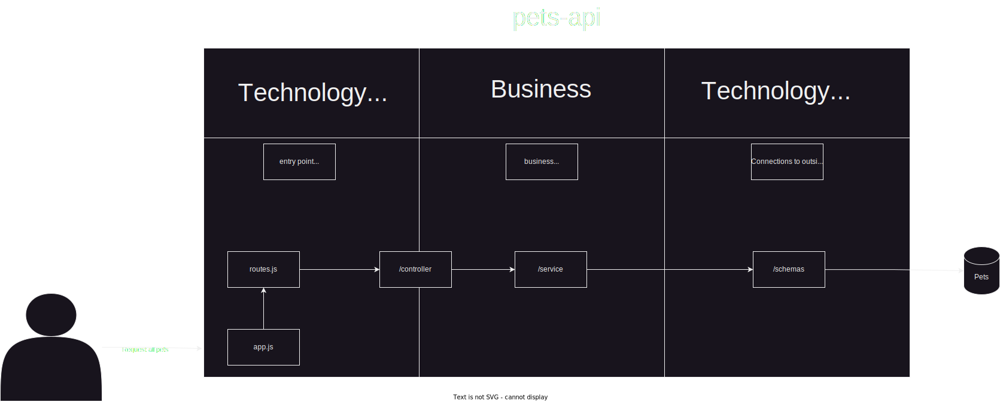

# Template of nodeJS API with Typescript
This is a template of an API in node.js using Typescript with mongo connection.
It creates a CRUD API for Pets resources

## Summary
- [API definition and routes](#api-definition-and-routes)
- [Run application](#run-application)
- [Project Architecture](#architecture)
- [Tech stack](#tec)

## API definition and routes
The API has the below endpoints
- POST `/registry` - Create an account
- POST `/login` - Login 
- GET `/pets` - Get all pets
- POST `/pets` - Create a pet
- DELETE `/pets/{id}` - Delete a pet by id
- PUT `/pets/{id}` - Update a pet by id

Below, you can see the details/contract of each endpoint

Create an account request body:
 ```json
 {
     "name": "Vitor Farias",
     "nickName": "vitorfariaz",
     "email": "vitorfariaz@outlook.com",
     "password": "blablabla",
 }
```

Login request body: 
```json
{
    "nickname": "vitorfariaz",
    "password": "blablabla"
}
```

Create pet request body:
```json
{
    "ownerUsername": "vitorfariaz",
    "name":"Bob",
    "age": 12,
    "type": "DOG",
    "breed": "CHIUAUA",
    "sex": "MALE",
}
```

Rules:
 - [ ] You have to Login to see others pets: 
 - [ ] You only could have 5 pets created
 - [ ] You could not create a pet with the same name and type


## Run Application
### With Docker (suggested)

Pre conditions
- Have installed [Docker](https://docs.docker.com/desktop/) 
- Have installed [docker-compose](https://docs.docker.com/compose/install/)


Steps
- Download the source files in your local machine
- Open the command prompt in the folder of the project 
- Run the script below
```
docker-compose up
```
Then, the API will be listen at port 3000 and it will create a mongo instance on port 2717


## Locally (Not recommended)

Pre conditions
- You must have installed [NodeJS](https://nodejs.org/en/download/) and [Yarn](https://classic.yarnpkg.com/lang/en/docs/install/#windows-stable) 
- You must have a mongoDB instance on port 27017
- You will have to update mongo url in src/app.ts and put `localhost` instead of `mymongo`

Steps
- Download the source files in your local machine
- Open the command prompt in the folder 
- Run the yarn scripts below on root folder (don't run the lines starting with `#`)
``` 
# Download the dependencies(you only have to run it for the first time)
yarn install

# Run the application
yarn dev
```
Then, the API will be listen at port 3000

To create a mongo instance locally
- Download [Docker](https://www.docker.com/products/docker-desktop/)
- Create and account in docker/dockerhub
- Initiate docker in your machine
- Run the command below to instantiate the mongoDB
```
# Download the mongo image and run it locally on port 2717
docker run -d -p 27017:27017 -v mongo-data:/data/db --name mymongo mongo:latest
```

- Download and install [MongoDB Compass](https://www.mongodb.com/try/download/compass) to perform queries


## Architecture

Macro architecture of the project
```
src/
    /controller
    /schemas
    /service
app.ts
routes.js
server.ts
```



The flow of a request will be:

`server` -> `app` -> `routes` -> `/controller` -> `/service` -> `/schemas`

### server.ts
It represents the server, we can specify the port that it will handle

### app.ts
Where the application starts
It starts the server with its routes and create the database connection

<br />

Used by `server.ts`

Use `routes.js`

### routes.js 
Registry all the routes/paths of our API and add the resolvers(functions) that will be executed for each route 

Used by `app.ts`

Use `/controller` functions


### /controller

Responsible to 
- Handle the call from the outside, call the internal domain and respond to the outside
- Handle business exceptions and translate it into API Errors
- Translate our internal models into API Responses
- Call our service domain layer

Used by `/routes.js`

Use `/service` layer


### /service

Responsible for Business rules

Used by `/controller`

Use `/schemas`


### /schemas
Represents our domain models and the models that we'll persist in mongo DB

We have: 
- Domain - Is the ORM, Object Relational Mapping. It respresents the "table" or "document" that we persist on mongo
- DomainInterface - It represents the business model entities. Could be not related to a database. 

Used by `/service`


## Tech stack 

- [mongoose](https://mongoosejs.com/)
- [docker](https://www.docker.com/)
- [docker-compose](https://docs.docker.com/compose/)
- [typescript](https://www.typescriptlang.org/)
- [express](https://expressjs.com/)
- [nodemon](https://www.npmjs.com/package/nodemon)
- [sucrase](https://www.npmjs.com/package/sucrase)
